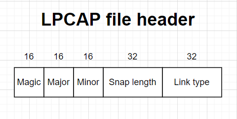
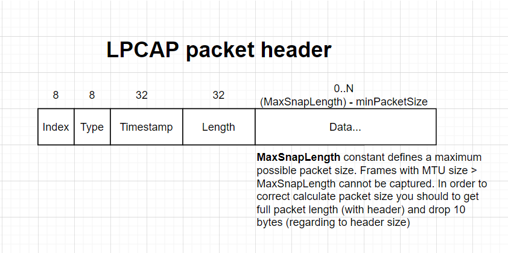

# Lightweight PCAP written in Go

This format is not backward compatible with original PCAP or Wireshark PCAP format. 

## Structure
Lightweight PCAP very similar to original PCAP format. Format also has file header (general) and packet headers that cames after file header. 
Sizes:
 - File header: 14 octets 
 - Packet header: minimal packet size is 10 octets, maximal packet size is 16383 (2^14-1) octets.

## File header

- Magic Number (16 bits):
an unsigned magic number, whose value is the hexadecimal number 0x4F3E.
- Major Version (16 bits):
an unsigned value, giving the number of the current major version of the format. The value for the current version of the format is 1. This value should change if the format changes in such a way that code that reads the new format could not read the old format (not backward compatible)
- Minor Version (16 bits):
an unsigned value, giving the number of the current minor version of the format. The value is for the current version of the format is 4. This value should change if the format changes in such a way that code that reads the new format could read the old format without checking the version number but code that reads the old format could not read all files in the new format.
- Snap length (32 bits): 
an unsigned value indicating the maximum number of octets captured from each packet. The portion of each packet that exceeds this value will not be stored in the file. This value MUST NOT be zero.
- Link type (32 bits):
an unsigned value that defines the link layer type of packets in the file.

## Packet header
 
- Index (8 bits): 
an unsigned value, an index of network interface where packet was been captured. 
- Type (8 bits): 
an unsigned value, traffic type to what packet has been assigned, can have several states: broadcast/multicast/unicast
- Timestamp (32 bits): 
an 32-bit unsigned integer that represents the number of nanoseconds that have elapsed since 1970-01-01 00:00:00 UTC. Value always represents in nanoseconds!
- Captured (Original) packet length (32 bits): 
an 32-bits unsigned integer value that indicates the actual length of the packet when it was transmitted on the network. 

## File extension
To avoid confusion with the extension of the original PCAP format, it is recommended to use the suffix "l" from the word "lightweight". 

Recommended file extension: `.lpcap`